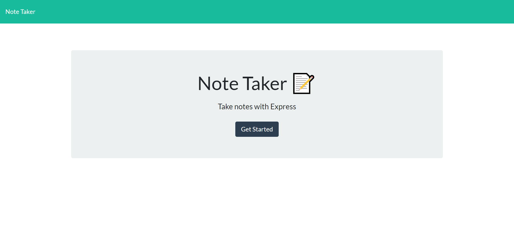
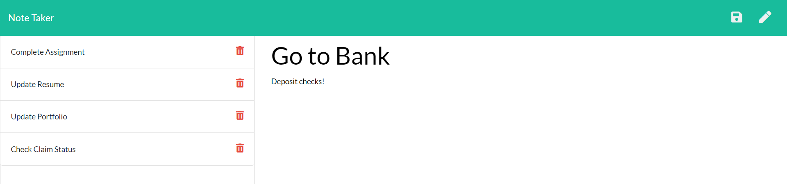

# Note Taker

 

## Description
An Express.js application for taking notes.
            
View the deployed page at .

 

## Contents
* [Usage](#Usage)
   * [Screenshots](#Screenshots)
* [Built With](#Built-With)
* [Questions](#Questions)
* [Credits](#Credits)

 

## Usage
* Click the "Get Started" button to start adding notes.
* Click on "Note Title" and "Note Text" fields to add notes.
* New notes can be saved using the floppy disc icon in the top-right of the browser.
* Saved notes will appear in the left-hand column.
* Clicking on a saved note will display the note in the right-hand column, allowing the user to edit their notes.
* The pencil icon will allow the user to add a new note at any time.
* The trash icon will permanently delete the selected note.

 
    
### Screenshots

Splash page for the Note Taker application.

 

The Note Taker application in use.

 

## Built With
* Node.js
* Express.js
* [UUID](https://www.npmjs.com/package/uuid)
* JavaScript
* HTML/CSS
* [BootStrap](https://getbootstrap.com/)

 
    
## Credits
* Starter code provided by GT Coding Boot Camp
